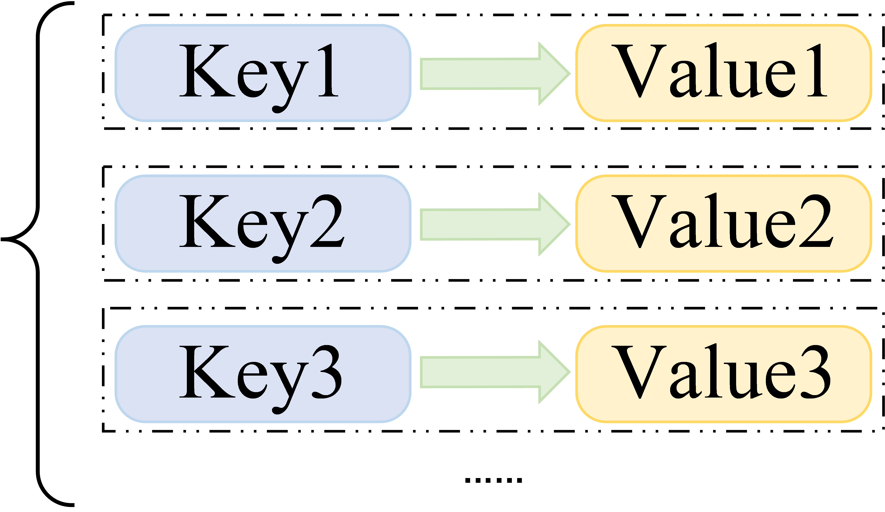

# 初识python特性：list，array，dic

​	在学习完上一章顺序，分支，循环结构后，理论上来说大家应该是具备了可以完成简单程序的能力，比如计算10个数中的最大值和最小值那些。所以接下来我们将会逐步进入涉及到python语言特性的部分，但是不用担心，这一章所要介绍的列表(list)，数组(array)以及字典(dictionary)在其他语言的学习中也很重要，我们在介绍这一部分的基础知识的同时，会扩展介绍一些python独有的功能供大家理解掌握。

## 初识列表（list）

list，在python中称作列表或者是序列，是python中最为基本的数据结构之一。list在python中的功能主要包括：加，乘，索引，切片，检查成员，查询长度，查询最大最小值。

首先是声明一个列表，我们只需要将目标元素用方括号括起来即可。

```python
[1,2,3,4,5]#数字类型的列表
['a','b','c','d','e','f']#字符串类型的列表
["apple","banana","passion"]#字符串类型的列表
```

python声明列表非常的直观和简单，它会自动根据列表里面每一个元素确定不同的类型，就比如：

```python
a=["1",1]
print(type(a[0]))
print(type(a[1]))

#答案是：
<class 'str'>
<class 'int'>
```

由此可见，相比于其他语言（C，C++等），python中的数据结构更加的灵活和直观，也更容易让人理解。

现在我们假设有一个列表[1,2,3,4,5]，我们逐步展示一下相关的基本操作，首先是两个列表相加：

```python
l = [1,2,3,4,5]+[1,2,3,4,5]
print(l)

#答案是：
#[1, 2, 3, 4, 5, 1, 2, 3, 4, 5]
```

所以我们可以知道，python中两个列表相加表明将两个列表元素合并，并且合并后内部顺序不变。接下来我们再试试乘法：

```python
l = [1,2,3,4,5]*4
print(l)

#答案是：
#[1, 2, 3, 4, 5, 1, 2, 3, 4, 5, 1, 2, 3, 4, 5, 1, 2, 3, 4, 5]
```

分析下来可以发现，电脑将列表内的元素重复了四遍，并且合并成了一个列表，所以乘法计算可以将列表重复一定的次数。那我们再看看列表是如何索引的：

```python
l = [1,2,3,4,5]
print(l[2])
print(l[4])
print(l[2:5])
#答案是：
#3 
#5
#[3, 4, 5]
```

下图反映了列表在计算机中列表索引与值的对应模式，之后数组，元组等数据结构均是这种逻辑对应关系。


由这张图可以很明显的知道，索引2对应值是3，索引4对应值是5，因此得到第一和第二个答案。那么 l[2:5] 代表什么含义呢？

在python中，如果我们要截取列表中某一个特定的区间进行处理，比如上述的第二个元素到第四个元素，我们可以直接选择 [$a$:$b$] 这种方式来直接对列表内部某一区间进行提取。[$a$:$b$] 表示选择索引从 $a$ 开始到 $b-1$ 结束的区间。我们接下来再举几个其他的例子。

```python
l = [1,2,3,4,5]
print(l[0:4])#表示取索引为0到3之间的区间
print(l[1:])#表示取索引从1开始直到最后一个元素的区间
print(l[-2])#表示取倒数第二个元素
print(l[-2:])#表示取从倒数第二个元素开始，直到最后一个元素的区间
print(l[:-2])#表示取从最开始直到倒数第二个元素的前一个元素的区间
print(l[:2])#表示取从开始到索引为1的区间

#答案是：
#[1, 2, 3, 4]
#[2, 3, 4, 5]
#4
#[4, 5]
#[1, 2, 3]
#[1, 2]
```

上述的一系列操作，也被称作切片，是python中特别重要的一类操作，后续会经常使用它。

假如我们想要知道一个元素是否在一个列表里时应该怎么做呢？当列表长度较短的时候我们可以直接通过肉眼进行查找，但是当列表非常长的时候，通过人工肉眼查找就显得不切实际。python提供了一种非常简洁的功能：in，具体使用场景如下：

```python
l = [1,2,3,4,5]
print(3 in l)
print(6 in l)

#答案是：
True
False
```

可以发现，我们可以使用（目标元素）in （列表）的形式判断是否列表中由我们想要的元素，返回结果为一个bool值，元素在列表内返回True，否则返回False。

然后是查询列表长度以及最值，我们可以直接调用函数len(list)和max(list),min(list)来进行处理，如下面的例子所示：

```python
l = [1,2,3,4,5]
print(len(l))#查询列表中元素的个数
print(max(l))#查询列表中最大值
print(min(l))#查询列表中最小值

#答案是
5
5
1
```

最后介绍一下列表中常用的一些方法，我们直接用样例进行示范：

首先是append函数，表示往列表最后插入一个指定的新元素。

```python
#list.append()
l = [1,2,3,4,5]
l.append(0)#往列表最后插入一个元素
print(l)
l.append(["a","b","c"])#往列表最后插入一个列表
print(l)

#答案是：
[1, 2, 3, 4, 5, 0]
[1, 2, 3, 4, 5, 0, ['a', 'b', 'c']]
```

注意上面两种插入方式的异同，如果仅仅插入元素，则新元素合并到原来的列表中，整体还是只有一个列表；如果插入另一个列表，则被插入列表作为一个整体元素被合并到原来的列表，成为一个嵌套列表。有关嵌套列表的知识可以查看 [菜鸟教程:嵌套列表部分](https://www.runoob.com/python3/python3-list.html) 。

然后是count函数，表示计算列表中某一元素 

```python
#list.count()
l = [1,2,3,4,5,4,3,3,1]
print(l.count(5))
print(l.count(4))
print(l.count(3))
#答案是
1
2
3

```


```python
#list.remove()
```


```python
#list.index()
```


```python
#list.copy()
```


```python
#list.extend()
```


## 认识数组（Array）

数组，作为计算机程序设计中最基础的一种数据结构，被广泛地应用于各种主流语言中。和列表相同，数组也有索引和值的概念。特别是在python中，数组有着更加方便和快捷的操作。

### 数组定义

首先是定义数组，在定义数组前，我们需要导入一个名叫numpy的包。（有时我们会使用array包下的array，但是不是很常用，我们接下来会同时讲到）

```python
import array as arr
import numpy as np
a1=np.array([1,2,3,4,5],float)#通过numpy定义数组，第一个位置放数组元素，第二个位置放元素类型，此处类型定义为浮点数float
a=arr.array('d',[1,2,3,4,5])#通过array定义数组，第一个位置放元素类型，第二个位置放数组元素
print(a,a1)
print(type(a),type(a1))

#答案是：
#array('d', [1.0, 2.0, 3.0, 4.0, 5.0]) [1. 2. 3. 4. 5.]
#<class 'array.array'> <class 'numpy.ndarray'>
```

可以发现上述两种方法的区别，通过array定义的数组输出时自带数据类型，而通过numpy定义的数组输出时则直接按照列表的形式输出。并且输出两种数组的类型也各不一样，一个属于array.array类一个属于numpy.ndarray类，需要根据实际情况区分。后续我们讨论数组的时候，均按照numpy定义的数据进行讨论。

### 数组基本操作

跟前面介绍到的列表有些许不同，数组虽然也支持加，乘，索引，切片，检查成员，查询长度，查询最大最小值，但是结果却不一样，接下来将会一起进行演示：

```python
import numpy as np
#定义num,num1
num = np.array([1,2,3,4,5],float)
num1 = np.array([6,7,8,9,10],float)

#数组相加
print(num+num1)
#数组相乘
print(num*num1)
print(num*4)
print(np.dot(num,num1))
print(np.dot([[1,2],[3,4]],[[1,2],[3,4]]))
#数组索引
print(num[2])
#数组切片
print(num[1:])
print(num[:-1])
#检查成员
print(3 in num)
print(8 in num)
#查询长度
print(np.size(num))
print(len(num))
print(np.size([[1,2],[1,3]]))
print(len([[1,2],[1]]))
#查询数组形状
print(np.shape([[1,2],[1,3]]))
#查询最大最小值
print(num.max(),num.min())
```


## 认识字典（dictionary）

相比于数组和列表，字典（dictionary）的结构显得比较特殊。它是由键值对组成的一种数据存储结构，和列表的从0开始按顺序索引不同的是，字典的键（key）是由人为定义的，并且具有唯一性，因此在某些特殊情况下更加灵活易用。具体形式如下图所示：



同一个字典中的Key确定后不可以再更改，值可以根据后续的情况再进行改变。举一个简单的例子：

```python
dic1={"Key1":1,"Key2":"123"}
print(dic1["Key1"])
dic1["Key1"]=666
print(dic1["Key1"])

#答案：
#1
#666
```

可以发现，字典通过Key来访问对应的Value并进行后续的操作，上述例子包含了字典的创建，值的查找以及字典中值的修改操作。

### 字典元素的删除

有时候我们想要删除字典的某一个或几个元素或者是删除整个字典，我们可以按照如下的方式进行操作：

```python
#字典Key的删除(字典元素删除)
dic1={"Key1":1,"Key2":"123"}
del dic1["Key2"]
print(dic1)
#结果1：
{'Key1': 1}

#字典内容清空
dic1={"Key1":1,"Key2":"123"}
dic1.clear()
print(dic1)
#结果2：
{}

#字典完全删除
dic1={"Key1":1,"Key2":"123"}
del dic1
print(dic1)
#结果3：
Traceback (most recent call last):
  File "C:\Users\李可\Desktop\Lab1\venv\test.py", line 3, in <module>
    print(dic1)
NameError: name 'dic1' is not defined
```

字典Key的特性有两个非常重要的点：

（1）Key必须是固定值，不可以更改变化，因此Key可以是数组、元组或者是字符串，但是不可以是列表

（2）一个字典中不可以有两个重复的Key值

### 字典的其他操作

```python
#计算字典长度(元素个数)
dic1={"Key1":1,"Key2":"123"}
print(len(dic1))

#以字符串的格式输出字典元素
dic1={"Key1":1,"Key2":"123"}
print(str(dic1))

#复制字典，进行浅拷贝
dic1={"Key1":1,"Key2":"123"}
dic2=dic1.copy()
print(dic2)

#判断某个Key是否在目标字典里
dic1={"Key1":1,"Key2":"123"}
print("Key1" in dic1)

#输出字典中所有的Key和所有的键值对元素
dic1={"Key1":1,"Key2":"123"}
print(dic1.keys())
print(dic1.items())
```

