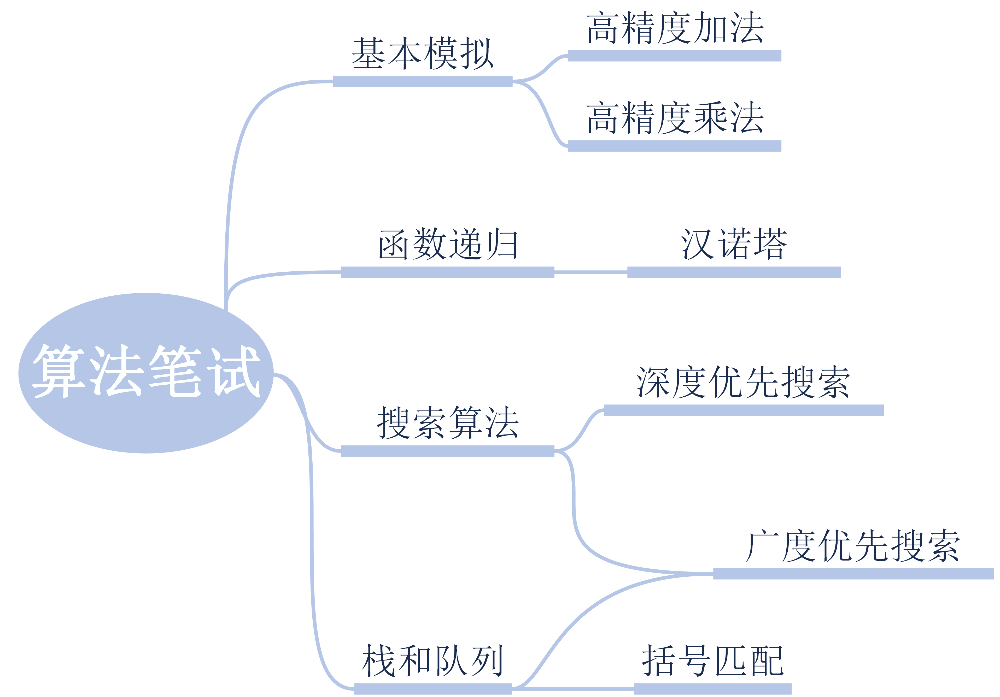
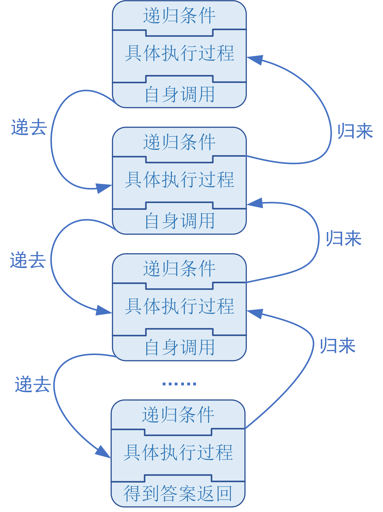
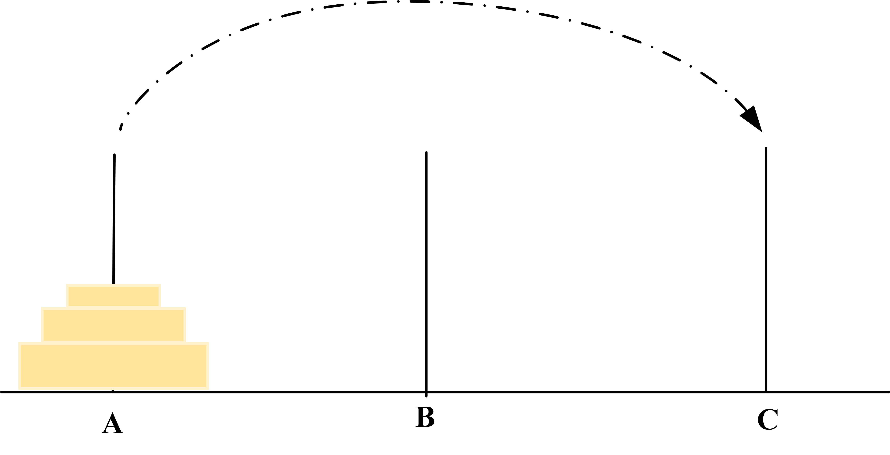
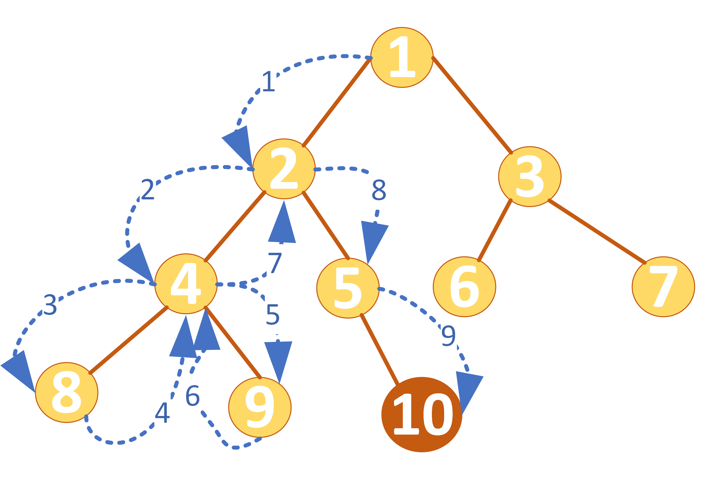
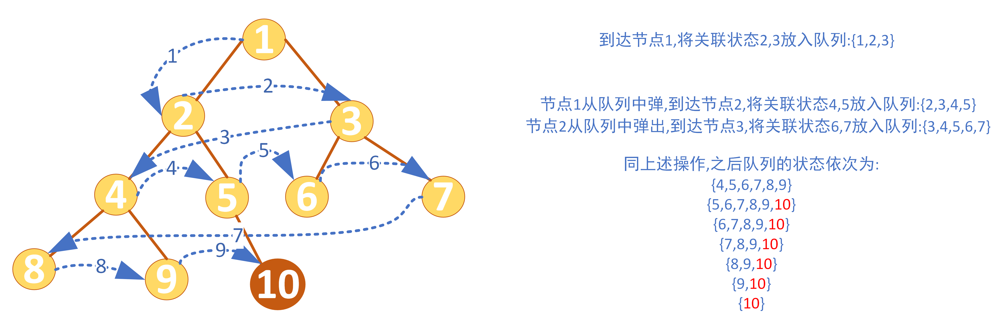
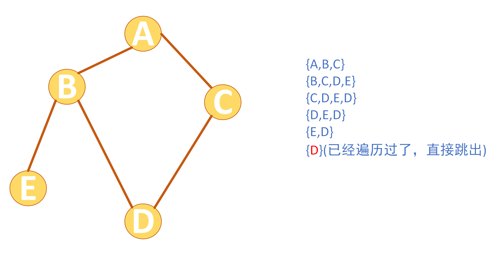
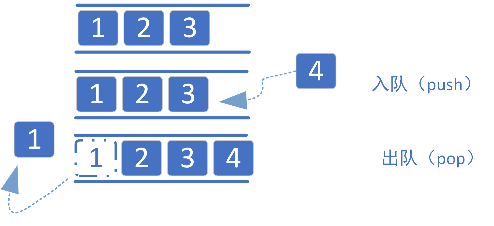

# 互联网求职中机试和面试中常见算法题目的Python实现

## 前言

在介绍完前面三个章节python的基本操作以及python函数的申明和调用后，相信大家对python相关的操作已经都非常熟练了。在掌握前三章的知识后，理论上来说足够大家应付目前国内互联网面试或者笔试时出现的题目了。由于传统算法和数据结构涵盖的范围比较广，接下来我会选择几个经典的方面给大家简要介绍一下相关的题型以及python程序的实现。

本章主要结构如下，并由六道例题展示常见的算法考察点：




## 基本模拟

在计算机中，模拟的意思就是建模，即是通过对事务进行抽象，然后根据实际问题建立对应的数学模型。计算机很难直接解决实际的问题，但是通过计算机来对实际问题进行数学建模就会大大方便计算机的“理解”和“解决”。

这一部分主要是前面三章基础内容的巩固和延申，且出现的题目主要考察如何设计程序让其能够按照题目要求的方式来得到答案，这一部分的能力的提升是非常重要的。

【题目4-1：高精度加法】

输入两个500位以内的十进制非负整数，并输出他们的和。

解析：对于一般的大整数，使用python来直接进行求和都是可以的，但是位数依然有限制。即便是long long int类型的整数最多也就能到64位。所以500位的整数相加直接进行计算显然是达不到要求的。

为了解决上面的问题，我们可以尝试通过电脑模拟竖式计算的过程，同时使用数组来储存大整数的每一位，这样的话就不会受到整数位数过多的影响。

按照以上思路，我们可以尝试开始编写程序：

```python
import numpy as np

if __name__=="__main__":
    a=str(input("输入第一个数字："))
    b=str(input("输入第二个数字："))
    max_len=max(len(a),len(b))
    A,B,C=list(),list(),list()
    for i in range(len(a)-1,-1,-1):
        A.append(int(a[i]))
    for i in range(len(b)-1,-1,-1):
        B.append(int(b[i]))
    for i in range(max_len):
        t=A[i]+B[i]
        C.append(t%10)
        t//=10
    Z=""
    for i in range(len(C)-1,-1,-1):
       Z+=str(C[i])
    print(Z)
```

接下来我详细解释一下程序编写的思路：

假设我们要进行514+495的竖式加法的计算，我们会经历如下过程：

| 数字      | 第4位    | 第3位     | 第2位     | 第1位 |
| --------- | -------- | --------- | --------- | ----- |
| a         |          | 5         | 1         | 4     |
| b         |          | 4         | 9         | 5     |
| 中间产物1 |          | 9         | 10        | 9     |
| 中间产物2 |          | 10（9+1） | 0（进位） | 9     |
| 中间产物3 | 1（0+1） | 0（进位） | 0         | 9     |
| 最终结果  | 1        | 0         | 0         | 9     |

所以竖式加法的实质就是模拟每一位的加法与进位。对于十进制的加法来说，某一位上的和超过9就会产生进位现象，即保留个位数，并且把十位数上的数字加到下一位上去。

我们可以看到，处理加法时必须从低位到高位进行计算，并且可以让处理加法和处理进位同时进行。

接下来让我们看看高精度乘法：

【题目4-2：高精度乘法】

输入两个500位以内的十进制非负整数，并输出他们的乘积。

解析：同样我们可以仿照上面竖式加法的例子进行竖式乘法。我们先列出表格看一下竖式计算的中间过程：

| 数       | 第六位 | 第五位 | 第四位 | 第三位 | 第二位 | 第一位 |
| -------- | ------ | ------ | ------ | ------ | ------ | ------ |
| a        |        |        |        | 5      | 1      | 4      |
| b        |        |        |        | 4      | 9      | 5      |
| a*b[1]   |        |        |        | 25     | 5      | 20     |
| a*b[2]   |        |        | 45     | 9      | 36     |        |
| a*b[3]   |        | 20     | 4      | 16     |        |        |
| 中间产物 |        | 20     | 49     | 50     | 41     | 20     |
| 处理进位 | 2      | 5      | 4      | 4      | 3      | 0      |
| 结果     | 2      | 5      | 4      | 4      | 3      | 0      |

参照上面的计算思路，我们可以尝试写出高精度乘法的代码。

```python
a = list(map(int, list(input("输入a："))))[::-1]
b = int(input("输入b:"))

t = 0   # 进位
c = []
for i in range(len(a)):
    t += a[i] * b
    c.append(t % 10)
    t //= 10

while t:  # 可能有多的进位
    c.append(t % 10)
    t //= 10

while len(c) > 1 and c[-1] == 0:  # 可能存在前导0
    c.pop()

print(''.join(map(str, c[::-1])))
```

## 函数递归

在第三章我们系统学习了函数的定义以及调用。但是在计算机程序设计中我们还有一种特殊的函数调用方式，让函数自己调用自己，从而来递归地解决实际问题。递归思想作为计算机科学中特有的一种思想，在后面很多高级算法设计中都有所体现，比如深度优先搜索或者是堆栈的设计，要详细讲述该思想比较复杂，这里用一张图来进行阐述：



简要来说就是同一个函数，在得到答案之前带着问题调用自身，把问题递到下一层（递去）；得到答案后，把答案一层一层往上传回去（带着答案“归来”）

接下来举一个汉诺塔的经典例题来进行分析：

#### 汉诺塔

【题目4-3：汉诺塔步数】

给一个n个盘子的汉诺塔，将其全部从A柱移到C柱，打印出每一步移动的步骤。

图例：



解析：我们先看来考虑只有一个盘子的情况，也就是n=1时，此时很简单只需要将其从A柱移动到C柱即可，注意这个特殊情况也称作递归的边界条件；当n=2时，我们需要先将一个盘子从A移动到B，在将下一个盘子从A移动到C，然后再将B的盘子移动到C；然后让我们考虑一下n=3时应该怎么处理，这个时候情况就显得有点复杂了，但是我们考虑一下递归的思路，尝试将一个大的问题拆分成一系列结构相同的子问题。我们可以将最底下的盘子当作一部份，上面n-1个盘子当作一部份，这样就可以化简成n=2的问题。然后对于上面n-1的整体，又可以变成两部分进行拆分。这样我们就可以将三根柱子按照情况分成出发柱、中间柱、目标柱，由此来构造函数。

```python
def move(n,a,b,c):
  if n == 1:
      print(a,'-->',c)
      return None
  else:
       move(n-1,a,c,b)
       print(a,'-->',c)
       move(n-1,b,a,c)

print(move(3, 'A', 'B', 'C'))
```

## 搜索算法

### 深度优先搜索

作为递归思想的进一步加深，深度优先搜索是非常经典的一类算法问题，并且跟后面二叉树以及图论关系紧密。下面我用图例解释一下深度优先搜索的思想：



在这样一个二叉树结构中，我们从1号根节点（root）出发，想要找到正确答案所在的10号节点，通过函数递归的顺序如上图所示。蓝色虚线箭头代表状态转移的方向。可以看到，程序先是按照深度优先的原则，遍历1-->2-->4-->8号节点，然后到达边界发现没有找到正确答案，回溯到4节点，又向9号节点转移状态，并如此循环往复，直到到达10号节点。

这样的深度优先递归策略可以遍历问题的每一个状态，最终得到我们想要的答案。接下来以一个例题解释一下：

#### 迷宫问题

【题目4-4：迷宫问题】

题目描述：给出一张图，输出从起点到终点的所有可能路径。

输入描述：第一行是整数n，m，分别是行数和列数。后面n行，每行m个符号。<strong>'@’是起点，’*’是终点，’·’能走，’#’是墙壁不能走</strong>。在每一步，都按<strong>左-上-右-下</strong>的顺序搜索。在样例中，左上角坐标(0,0)，起点坐标(1,1)，终点坐标(0,2)。1&lt;n, m &lt;7。

输出描述：输出所有的路径。坐标(i,j)用ij表示，例如坐标(0,2)表示为02。<strong>从左到右是i，从上到下是j。</strong>

输入样例：

5 3
.#.
#@.
*..
...
#.#

输出样例：

from 11 to 02
1: 11->21->22->12->02
2: 11->21->22->12->13->03->02
3: 11->21->22->23->13->03->02
4: 11->21->22->23->13->12->02
5:11->12->02
6: 11->12->22->23->13->03->02
7:11->12->13->03->02

本题目参考：

[算法通关手册](https://blog.csdn.net/m0_69478345/article/details/128476009?spm=1001.2101.3001.6661.1&utm_medium=distribute.pc_relevant_t0.none-task-blog-2%7Edefault%7EBlogCommendFromBaidu%7EPaidSort-1-128476009-blog-128944423.235%5Ev43%5Epc_blog_bottom_relevance_base9&depth_1-utm_source=distribute.pc_relevant_t0.none-task-blog-2%7Edefault%7EBlogCommendFromBaidu%7EPaidSort-1-128476009-blog-128944423.235%5Ev43%5Epc_blog_bottom_relevance_base9&utm_relevant_index=1)

```python
def dfs(x, y):
    global num
    for i in range(0, 4):  # 每次搜索有四个方向可以选择
        dir = [(-1, 0), (0, -1), (1, 0), (0, 1)]  # 四个方向左、上、右、下
        nx, ny = x + dir[i][0], y + dir[i][1]  # 新坐标
        if nx < 0 or nx >= hx or ny < 0 or ny > wy:  # 判断出局：不在地图内
            continue  # 换个方向，继续找下一个路径
        if mp[nx][ny] == '*':  # 到达终点一次
            num += 1
            print("%d:%s->%d%d" % (num, p[x][y], nx, ny))  # 打印路径:起点到上一个点的路径->终点
            continue  # 换个方向，继续找下一个路径
        if mp[nx][ny] == ".":  # 可以走的路
            mp[nx][ny] = "#"  # 保存现场(用#表示)。这个点在这次更深的dfs中不能再用
            p[nx][ny] = p[x][y] + '->' + str(nx) + str(ny)  # 记录路径：起点到上一个点的路径——>下一个点
            dfs(nx, ny)
            mp[nx][ny] = '.'  # 恢复现场。回溯之后，这个点可以再次用


num = 0  # 统计路径个数
wy, hx = map(int, input().split())  # Wy行，Hx列。
a = [""] * 10  # 用来保存迷宫
for i in range(wy):  # 读迷宫,每次读一行
    a[i] = list(input())
mp = [[' '] * 10 for i in range(10)]  # 二维矩阵mp[][]表示迷宫

# 把a存到mp中（x,y颠倒，因为第一维坐标是y，第二维坐标是x）；找到起点和终点
for x in range(hx):
    for y in range(wy):
        mp[x][y] = a[y][x]
        if mp[x][y] == '@': sx = x; sy = y  # 起点
        if mp[x][y] == "*": tx = x; ty = y  # 终点
print("from %d%d to %d%d" % (sx, sy, tx, ty))
p = [[''] * 10 for i in range(10)]  # 记录从起点到点path[i][i]的路径
p[sx][sy] = str(sx) + str(sy)  # 把起点存进路劲
dfs(sx, sy)  # 从起点开始搜索并输出所有的路径
```

### 广度优先搜索

与深度优先搜索相对的是广度优先搜索。相比于深度优先搜索通过递归的方式优先按照状态树的深度遍历，广度优先搜索则是先遍历完每一层的所有节点后，再进行下一层的状态遍历，具体可以参下下面的图示：



广度优先搜索是基于队列实现的一种搜索算法。先将遍历到的状态节点相关联的节点按照顺序放入队列，然后再从队列前端依次弹出待遍历节点进行状态搜索，由此可以实现逐层遍历的效果。

#### 无向图的广度优先遍历

下面是对无向图进行广度优先遍历的例子：

起点从A开始，输出按照广度优先的顺序访问图中所有节点的顺序。



```python
from collections import deque

class Graph:
    def __init__(self):
        self.graph = {}

    def add_edge(self, node, neighbors):
        self.graph[node] = neighbors

def bfs(graph, start):
    visited = set()
    queue = deque([start])

    while queue:
        node = queue.popleft()
        if node not in visited:
            print(node, end=" ")
            visited.add(node)
            queue.extend(neighbor for neighbor in graph[node] if neighbor not in visited)


g = Graph()
g.add_edge('A', ['B', 'C'])
g.add_edge('B', ['A', 'D', 'E'])
g.add_edge('C', ['A', 'D'])
g.add_edge('D', ['B', 'C'])
g.add_edge('E', ['B'])

bfs(g.graph, 'A')
```

## 栈和队列

#### 队列

首先是队列，在前面的广度优先遍历中我们已经使用过队列的相关技巧，这里便不在多做赘述，仅仅再简要提一下队列的思想。

队列（queue）是一种遵循先入先出规则的线性数据结构，模拟了排队现象，即新来的人不断加入队列尾部，而位于队列头部的人逐个离开。我们将队列头部称为“队首”，尾部称为“队尾”，将把元素加入队尾的操作称为“入队”（push），删除队首元素的操作称为“出队”(pop)。



#### 栈

栈（stack）是一种遵循先入后出逻辑的线性数据结构。

我们可以将栈类比为桌面上的一摞盘子，如果想取出底部的盘子，则需要先将上面的盘子依次移走。我们将盘子替换为各种类型的元素（如整数、字符、对象等），就得到了栈这种数据结构。

我们把堆叠元素的顶部称为“栈顶”，底部称为“栈底”。将把元素添加到栈顶的操作叫作“入栈”（push），删除栈顶元素的操作叫作“出栈”（pop）。


接下来我以一道例题来详细说明栈的用处：

【括号匹配】

给定一个只包括 ‘(’，’)’，’{’，’}’，’[’，’]'的字符串，判断字符串是否有效。

有效字符串需满足：
   左括号必须用相同类型的右括号闭合。 左括号必须以正确的顺序闭合。 注意空字符串可被认为是有效字符串。

示例 1:
   输入: “([{}])”
   输出: true
示例 2:
   输入: “([)]”
   输出: false

```python
#!/usr/bin/python3

text = "({[({{}})][{1}]})2([]){({[]})}[]"


def is_closed(text:str) -> bool:  
    """
    判断文本中括号是否封闭
    :param:text 包含括号的文本字符串
    :returns: True无括号或所有括号全部封闭
                   False 存在括号不封闭
    """
    stack = []  # 使用list模拟栈, stack.append()入栈, stack.pop()出栈并获取栈顶元素
    brackets = {')':'(',']':'[','}':'{'}  # 使用字典存储括号的对应关系, 使用反括号作key方便查询对应的括号
    for char in text:
        if char in brackets.values():   # 如果是正括号,入栈
            stack.append(char)
        elif char in brackets.keys():  # 如果是反括号
            if brackets[char] != stack.pop():  # 如果不匹配弹出的栈顶元素
                return False
    return True

print(is_closed(text))
```
